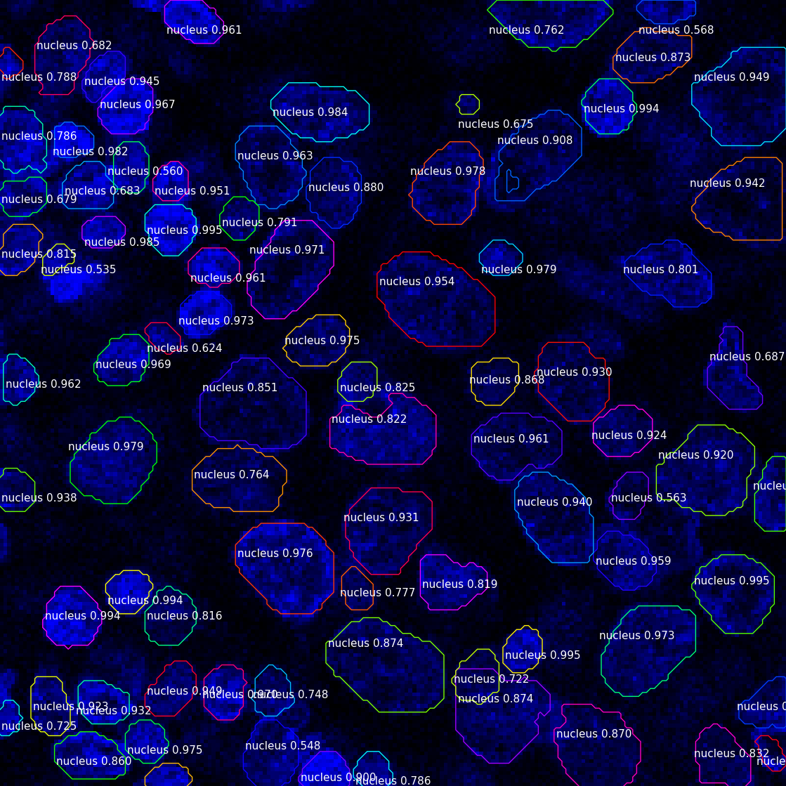

# Microscopy 3D Image Analysis

- Developed, tested, and integrated machine learning models for cell instance segmentation using TensorFlow and PyTorch, achieving high segmentation accuracy
- Designed and implemented data preprocessing pipelines, significantly reducing processing time.
- Built scalable backend services using Flask, Docker, and microservice architecture, streamlining the deployment of AI solutions.

